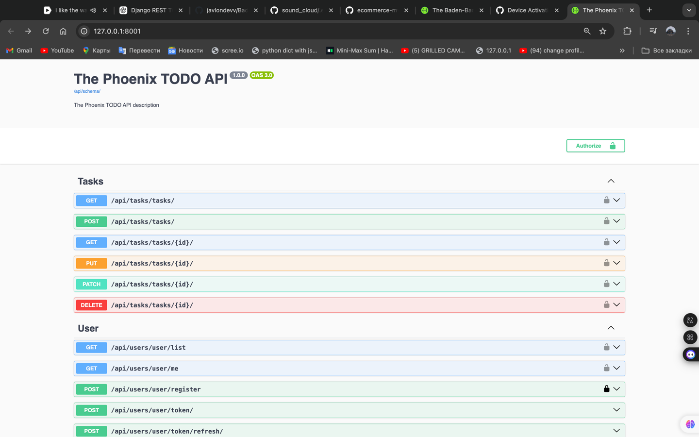

# Phoenix Todo Project

## Обзор

**Phoenix Todo Project** — это веб-приложение на базе Django, которое предоставляет систему управления задачами. Оно позволяет пользователям регистрироваться, аутентифицироваться и эффективно управлять своими задачами. Приложение использует Django Rest Framework (DRF) для создания API и поддерживает JWT (JSON Web Tokens) для безопасной аутентификации пользователей.

## Возможности

- Регистрация и аутентификация пользователей с использованием JWT.
- Создание, получение, обновление и удаление задач.
- Управление задачами, специфичными для пользователя, для обеспечения конфиденциальности и безопасности.
- Встроенная поддержка аутентификации на основе токенов.

## Используемые технологии

- **Бекенд**: Django, Django Rest Framework
- **База данных**: PostgreSQL
- **Аутентификация**: JWT (с использованием `rest_framework_simplejwt`)
- **Docker**: Для контейнеризации и развертывания
- **Документация**: DRF Spectacular для автоматической генерации документации API

## Начало работы

### Предварительные требования

- Python 3.x
- Docker и Docker Compose
- PostgreSQL установлен или используйте предоставленный Docker-setup

### Установка

1. Клонируйте репозиторий:
   ```bash
   git clone https://github.com/javlondevv/phoenix_todo_project.git
   cd phoenix_todo_project


Создайте файл .env в корневом каталоге проекта и настройте свои переменные окружения:

env
Copy code
SECRET_KEY=ваш_секретный_ключ
DB_ENGINE=django.db.backends.postgresql
DB_NAME=phoenix_todo_db
DB_USER=phoenix_todo_user
DB_PASS=ваш_пароль_к_базе_данных
DB_HOST=db
DB_PORT=5432
ALLOWED_HOSTS=0.0.0.0, localhost
DEBUG=1
Соберите и запустите контейнеры Docker:

bash
Copy code
docker-compose up --build

Примените миграции:

bash
Copy code
docker-compose exec web python manage.py migrate
Создайте суперпользователя (необязательно):

bash
Copy code
docker-compose exec web python manage.py createsuperuser
Получите доступ к приложению:

Откройте браузер и перейдите по адресу http://localhost:8000/.


Документация API
API Пользователей
Регистрация пользователя

Эндпоинт: POST /api/users/register/
Тело запроса:
json
Copy code
{
  "username": "user1",
  "password": "ваш_пароль",
  "email": "user@example.com"
}
Ответы:
201 Created: Пользователь успешно зарегистрирован.
400 Bad Request: Ошибки валидации, такие как отсутствующий или уже существующий пользователь.
Получение токена

Эндпоинт: POST /api/users/token/
Тело запроса:
json
Copy code
{
  "username": "user1",
  "password": "ваш_пароль"
}
Ответы:
200 OK: Токен успешно получен.
401 Unauthorized: Неверные учетные данные.
Обновление токена

Эндпоинт: POST /api/users/token/refresh/
Тело запроса:
json
Copy code
{
  "refresh": "ваш_refresh_токен"
}
Ответы:
200 OK: Новый токен доступа предоставлен.
401 Unauthorized: Неверный refresh токен.
Проверка токена

Эндпоинт: POST /api/users/token/verify/
Тело запроса:
json
Copy code
{
  "token": "ваш_access_токен"
}
Ответы:
200 OK: Токен действителен.
401 Unauthorized: Токен недействителен.
Получение текущего пользователя

Эндпоинт: GET /api/users/me/
Ответы:
200 OK: Информация о пользователе возвращена, включая username и email.
401 Unauthorized: Пользователь не аутентифицирован.
Список пользователей (только для админа)

Эндпоинт: GET /api/users/
Ответы:
200 OK: Список всех пользователей.
API Задач
Список/Создание задач

Эндпоинт: GET /api/tasks/ (Список), POST /api/tasks/ (Создание)
Тело запроса для создания:
json
Copy code
{
  "title": "Новая задача",
  "description": "Описание задачи",
  "due_date": "2024-12-31"
}
Ответы:
200 OK: Задачи перечислены или задача успешно создана.
201 Created: Задача создана.
400 Bad Request: Ошибки валидации, такие как отсутствующее поле.
Получение/Обновление/Удаление задачи

Эндпоинт: GET /api/tasks/{id}/ (Получение), PUT /api/tasks/{id}/ (Обновление), DELETE /api/tasks/{id}/ (Удаление)
Тело запроса для обновления:
json
Copy code
{
  "title": "Обновленная задача",
  "description": "Обновленное описание",
  "due_date": "2024-12-31"
}
Ответы:
200 OK: Задача успешно получена или обновлена.
204 No Content: Задача удалена.
404 Not Found: Задача не существует.


### Пояснения:

1. **Структура документа**: Включает общие сведения, возможности, используемые технологии, инструкции по началу работы, документацию API, информацию о тестировании, лицензии и благодарности.
2. **Настройки**: Убедитесь, что все ссылки и упоминания о вашем репозитории верны.
3. **Детали API**: Отражает ваши API, включая примеры запросов и ответов, что помогает пользователям понять, как взаимодействовать с вашим приложением.
# phoenix_todo_project
